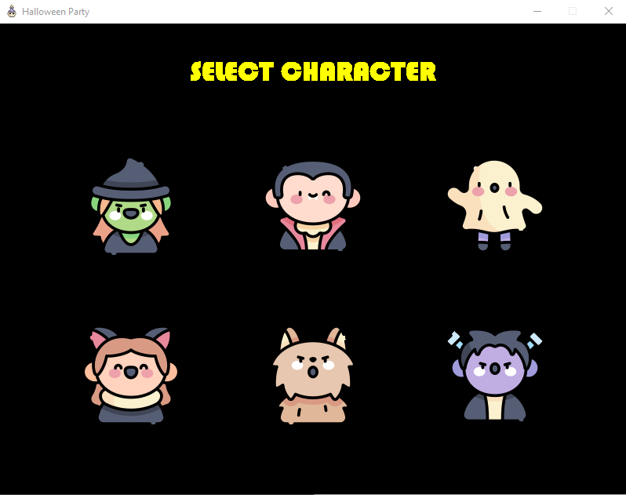
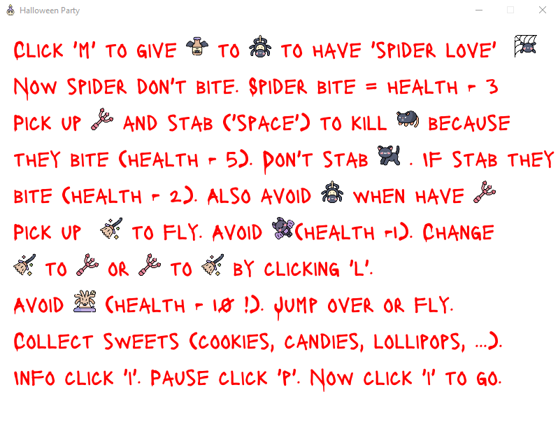
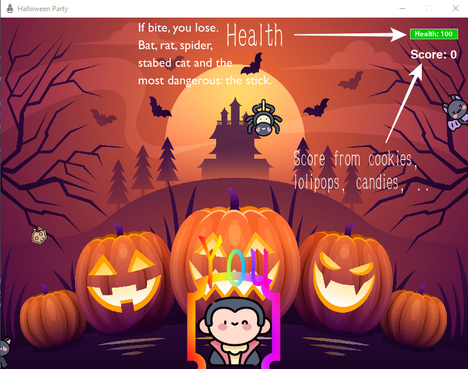
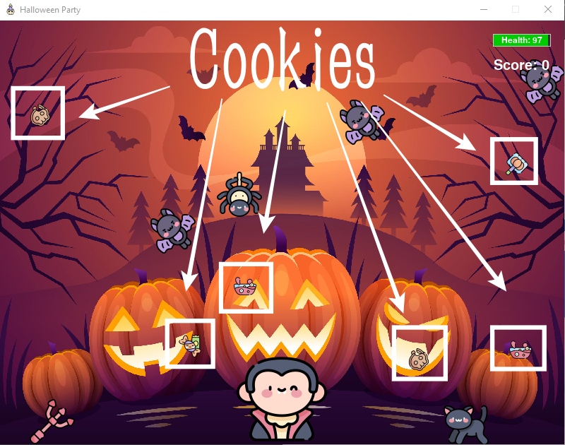
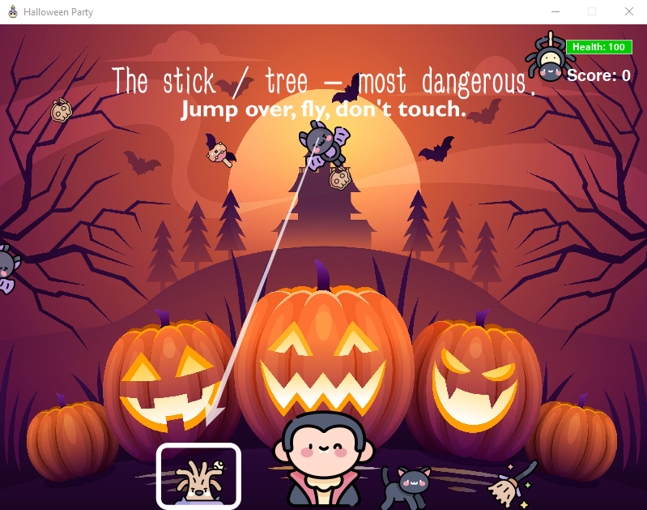
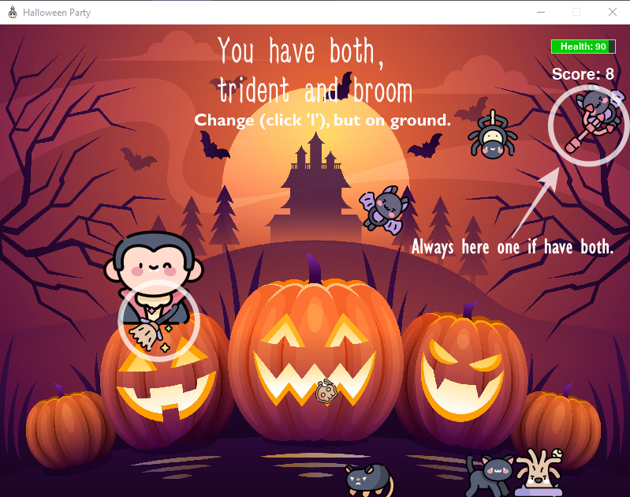

# Halloween Game  in Python
My first game with pygame.

## How I work
I used PyCharm editor, graphic are from flaticon, background from freepik and sound are from couple sources i.a. opengameart, findsounds.
My start was with tuturial [on youtube](https://www.youtube.com/watch?v=FfWpgLFMI7w). When I found out in making game in pygame,
I up to date changing in my game things that I want to be different. As my progress in creation, I add new characters and action;
I processed the principles following logic.

I invented the game spontaneously, I was inspired by the pictures. 
While introducing new ideas, I was learning a lot about new python concepts.
The programming thinking I gained during the course helped me a lot while working on the project.
There is still a lot to add to the game. But now, I'm working on the Christmas game with a sliding screen concept.

## How Game work
First, select character you will play. 

Click mouse on pic you like the best. The default is a witch (click "v").
Next, you have instruction. 

You can always peep this (click "i"). I hope everything is understandable.
Maybe this game is not interesting enough, but it was mainly used to learn concepts.
How game look:

